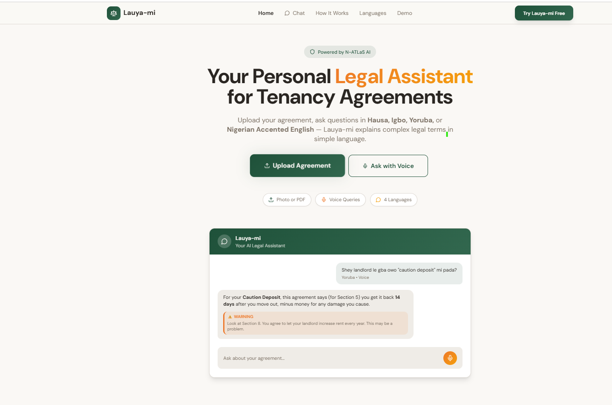

# 🏠 Lauyami Legal Assistant

<div align="center">



**AI-powered legal assistant for analyzing tenancy agreements**

[](https://opensource.org/licenses/MIT)
[](https://www.python.org/)
[](https://reactjs.org/)

</div>

## 📖 Overview

Lauyami helps tenants and landlords understand their tenancy agreements in the context of **Lagos State Tenancy Law 2011**. Upload your agreement, chat with AI, and get instant analysis with voice support in 4 Nigerian languages.

### ✨ Key Features

- 📄 **Document Analysis** - Identify rights, warnings, and predatory clauses
- 💬 **AI Chat** - Ask questions about your agreement or general tenancy law
- 🎤 **Voice Queries** - Speak in English, Yoruba, Hausa, or Igbo
- 🔊 **Text-to-Speech** - Listen to analysis in your preferred language
- 📊 **PDF Reports** - Download professional analysis reports

## 🏗️ Architecture

**Monorepo Structure:**
```
lauyami-app/
├── backend/          FastAPI + Python (Google Cloud Run)
├── frontend/         React + Vite (Vercel)
└── static/           Assets and screenshots
```

**Tech Stack:**
- **Backend**: FastAPI, Modal (N-ATLaS LLM/ASR), Qdrant, YarnGPT TTS
- **Frontend**: React, Vite, Shadcn UI, TanStack Query
- **AI**: RAG with optimized vector search and caching

## 🚀 Quick Start

### Backend
```bash
cd backend
make run-dev
```

### Frontend
```bash
cd frontend
npm install
npm run dev
```

📚 **Detailed Setup**: See [`backend/README.md`](backend/README.md) and [`frontend/README.md`](frontend/README.md)

🌐 **Deployment**: See [`CLOUD_RUN_DEPLOYMENT_GUIDE.md`](CLOUD_RUN_DEPLOYMENT_GUIDE.md)

## 🔮 Future Improvements

1. **Fine-tune N-ATLaS LLM** on tenancy agreements and property legal documents
2. **Expand Jurisdiction** - Add Abuja, Ibadan, and other Nigerian states
3. **Optimize Latency** - Improve document analysis speed
4. **Tenement Rate Features** - Add explanations for tenement rate agreements
5. **Enhanced Voice Experience** - Improve language selection and audio latency
6. **Advanced Reports** - Enhanced PDF generation with more insights
7. **Microservices Architecture** - Migrate from monolith to distributed services
8. **Pricing & Personalization** - Add subscription tiers and user accounts

## 📄 License

MIT License - see [LICENSE](backend/LICENSE)

---

<div align="center">
  <sub>Built with ❤️ for Nigerian tenants and landlords</sub>
</div>

